<div align="center">

# 🎬 AnimeTracker

**Explora animes, marca los capítulos que ya viste y entérate cuando salga uno nuevo.**


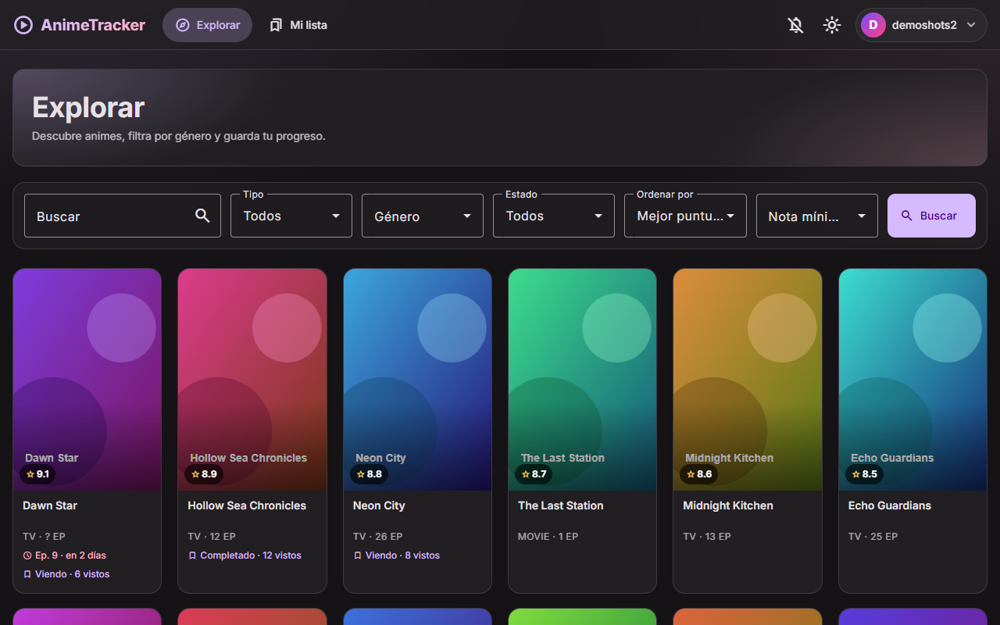

<sub>Capturas con datos de demostración y carteles generados. Los datos reales vienen de <a href="https://anilist.co">AniList</a>.</sub>

</div>

---

## 📑 Contenido

1. [¿Qué es?](#-qué-es)
2. [Funciones](#-funciones)
3. [Galería](#-galería)
4. [Puesta en marcha](#-puesta-en-marcha)
5. [Cómo está hecha](#-cómo-está-hecha)
6. [Referencia de la API](#-referencia-de-la-api)
7. [Configuración](#-configuración)
8. [Scripts](#-scripts)
9. [Pruebas](#-pruebas)
10. [Seguridad](#-seguridad)
11. [Docker, CI y PWA](#-docker-ci-y-pwa)
12. [Solución de problemas](#-solución-de-problemas)
13. [Créditos](#-créditos)

---

## 🧭 ¿Qué es?

AnimeTracker es una aplicación web para llevar el control de lo que ves:

- Busca en el catálogo de **AniList** con filtros por género, tipo, estado y nota.
- Marca **capítulo por capítulo** lo que ya viste, ponle **estado**, **nota** y **comentarios**.
- Activa el aviso de **capítulos nuevos** y la app los revisa sola.
- Tu cuenta y tu lista viven en **tu propia base de datos MySQL**, con sesión segura.

> **En una frase:** un *MyAnimeList* personal, rápido, instalable en el móvil y que controlas tú.

---

## ✨ Funciones

| | Función | Detalle |
|---|---|---|
| 🔎 | **Catálogo con filtros** | Tipo, género, estado, nota mínima y orden. Los filtros viven en la **URL**: se pueden compartir y sobreviven a recargar. Búsqueda con pausa y desplazamiento infinito. |
| ✅ | **Seguimiento por capítulo** | Casillas por capítulo, barra de progreso, "Marcar todos", orden **ascendente/descendente** (se recuerda) y botón **Continuar: Capítulo N**. |
| 🏷️ | **Estado, nota y comentarios** | Viendo · Pendiente · Completado · Abandonado, nota de 1 a 10 y notas personales. Mi lista se filtra por estado. |
| 🔔 | **Avisos de capítulos nuevos** | Se revisan al iniciar sesión, cada 15 min y al volver a la pestaña. Opcionalmente con **notificaciones del navegador**. Cada tarjeta muestra cuándo sale el próximo capítulo. |
| 👤 | **Perfil editable** | Cambia tu nombre de usuario, el color del avatar, la contraseña y, si quieres, elimina tu cuenta con todos tus datos. |
| 🧵 | **Migas de pan** | Desde un anime, "Volver" regresa a donde venías (Explorar o Mi lista). |
| 🎨 | **Tema claro y oscuro** | Sigue al sistema hasta que elijas uno; se recuerda. |
| 📱 | **Responsive y PWA** | Barra inferior en móvil y se puede **instalar** como app. |
| ♿ | **Accesible** | Enlace "Saltar al contenido", etiquetas ARIA y revisión automática con **axe** (WCAG 2.1 AA). |

---

## 🖼️ Galería

<table>
  <tr>
    <td width="50%"><b>Detalle y seguimiento</b><br>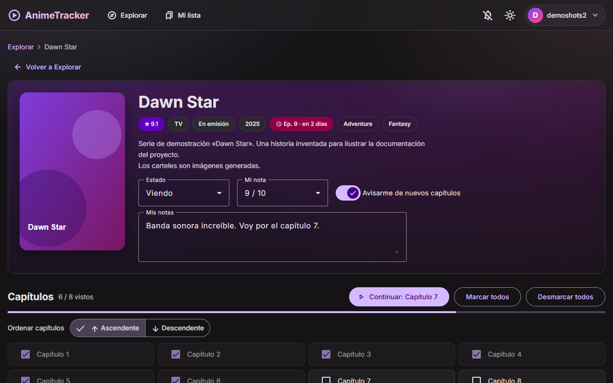</td>
    <td width="50%"><b>Capítulos (orden descendente)</b><br>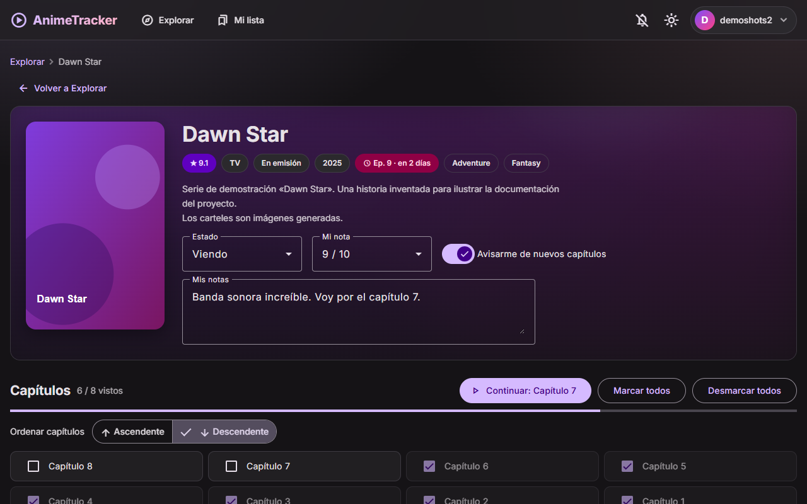</td>
  </tr>
  <tr>
    <td><b>Mi lista, con filtro por estado</b><br>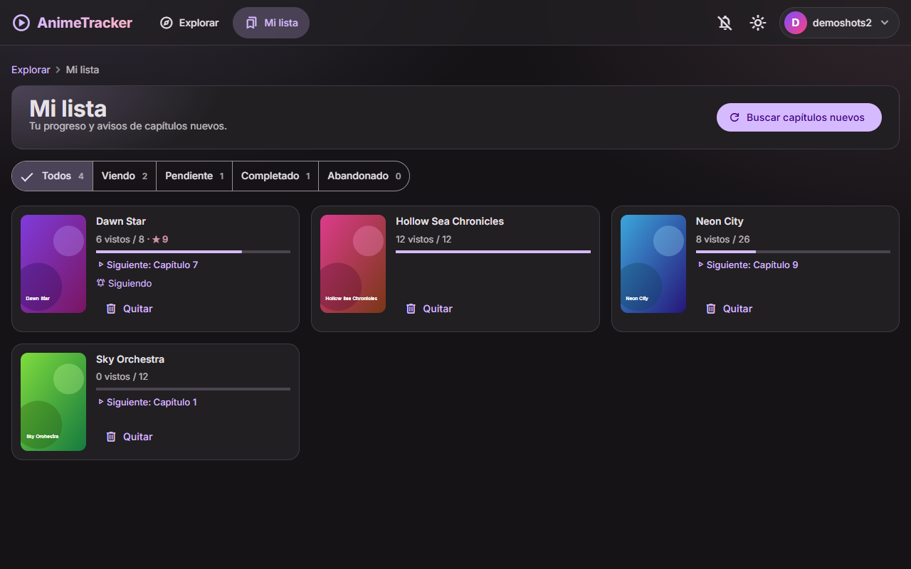</td>
    <td><b>Filtros en la URL</b><br>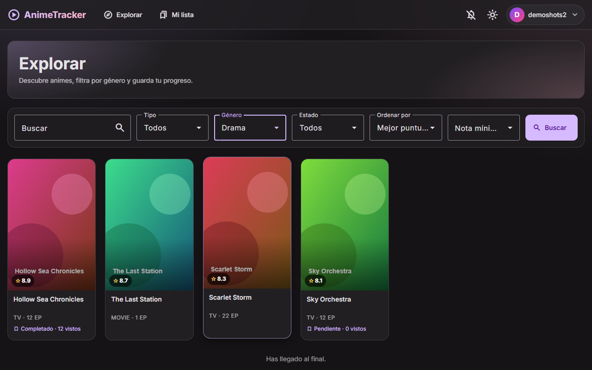</td>
  </tr>
  <tr>
    <td><b>Perfil</b><br>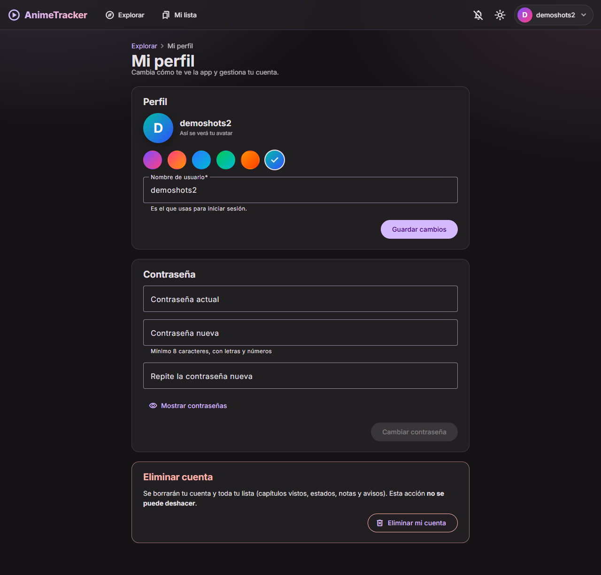</td>
    <td><b>Tema claro</b><br>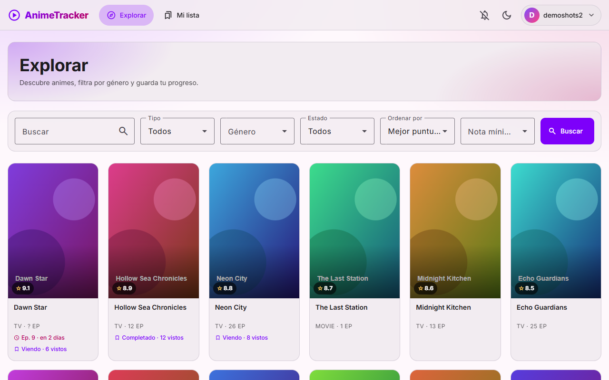</td>
  </tr>
  <tr>
    <td><b>Inicio de sesión</b><br>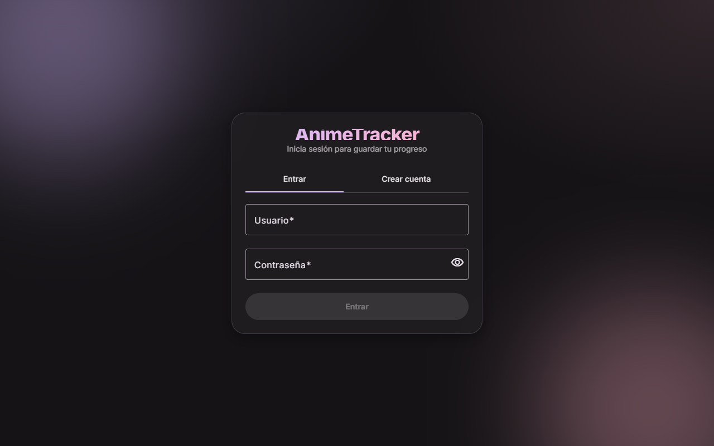</td>
    <td><b>Menú de usuario</b><br>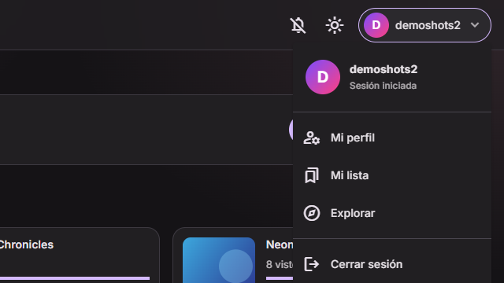</td>
  </tr>
</table>

<div align="center">

**En el móvil**

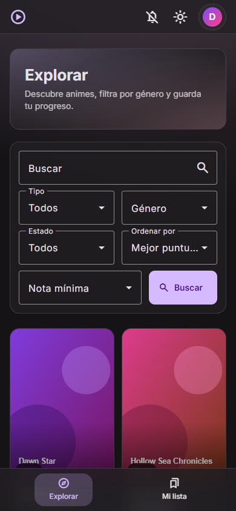&nbsp;&nbsp;&nbsp;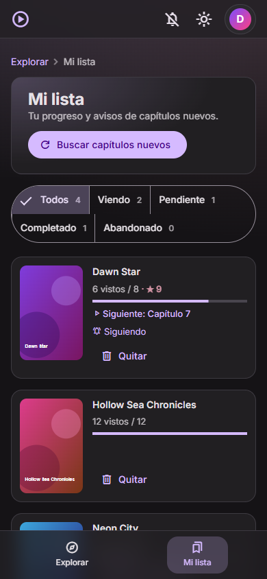

</div>

> Para regenerar las capturas: `node scripts/screenshots.mjs` (con la app en marcha).

---

## 🚀 Puesta en marcha

### Requisitos

| Herramienta | Versión | Para qué |
|---|---|---|
| Node.js | 22 o superior | Frontend y API |
| MySQL | 8 | Cuentas y listas |
| Navegador | Edge / Chrome | Para usar la app (y para las pruebas e2e) |

### Paso a paso

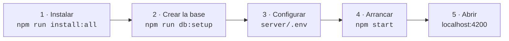

**1. Instala las dependencias** (frontend y API):

```bash
npm run install:all
```

**2. Crea la base de datos y un usuario de MySQL con permisos mínimos.** Las credenciales de administrador solo se leen del entorno y **no se guardan**:

```bash
# Linux / macOS / Git Bash
cd server
ADMIN_USER=root ADMIN_PASSWORD=tu-clave-admin APP_PASSWORD=una-clave-para-la-app \
DB_NAMES=anime_tracker,anime_tracker_test npm run db:setup
```

```powershell
# PowerShell
cd server
$env:ADMIN_USER='root'; $env:ADMIN_PASSWORD='tu-clave-admin'
$env:APP_PASSWORD='una-clave-para-la-app'; $env:DB_NAMES='anime_tracker,anime_tracker_test'
npm run db:setup
```

Debes ver:

```text
OK: base anime_tracker lista
OK: base anime_tracker_test lista
OK: usuario anime_app con permisos limitados
```

> `anime_tracker_test` solo la usan las pruebas e2e. El script es **idempotente**: puedes volver a ejecutarlo cuando haya migraciones nuevas.

**3. Configura la API.** Copia el ejemplo y rellena `DB_PASSWORD` (la `APP_PASSWORD` de arriba) y `JWT_SECRET`:

```bash
cp server/.env.example server/.env
node -e "console.log(require('crypto').randomBytes(48).toString('hex'))"   # úsalo como JWT_SECRET
```

**4. Arranca todo con un solo comando** (API en `:3000` y frontend en `:4200`):

```bash
npm start
```

**5. Abre <http://localhost:4200>**, crea una cuenta y empieza a explorar.

> 💡 La API y el frontend deben estar **los dos** en marcha. Si ves *"No se pudo conectar con el servidor"*, casi siempre es que falta la API.

---

## 🏗️ Cómo está hecha

### Vista general

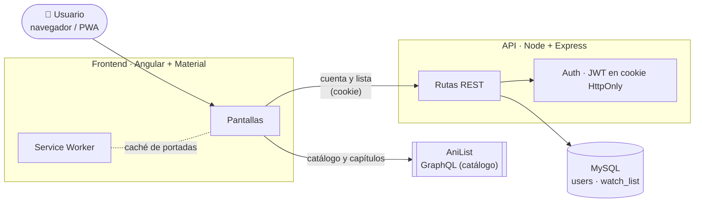

El catálogo se consulta **directamente a AniList** desde el navegador. Tu cuenta y tu lista pasan siempre por **tu API**, que es la única que habla con MySQL.

### Arquitectura por capas (frontend)

Cada capa solo conoce a la de su derecha; el **dominio no depende de nada**. Las dependencias externas (AniList, HTTP, localStorage, notificaciones) están detrás de **puertos** (interfaces) y se unen en un único sitio, `app.config.ts`.

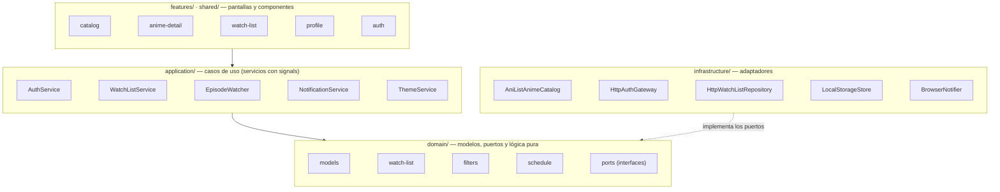

Por qué así:

- **Cambiar de proveedor es barato.** Se pasó de Jikan a AniList escribiendo un solo adaptador.
- **La lógica importante es pura** (`domain/watch-list.ts`): inmutable, sin Angular, fácil de probar.
- **Los tests no necesitan red ni base de datos**: usan implementaciones falsas de los puertos.

### Estructura del proyecto

```text
anime-tracker/
├─ src/app/
│  ├─ domain/            Modelos, puertos y lógica pura (lista, filtros, horarios, contraseña…)
│  ├─ application/       Servicios: sesión, lista, avisos, notificaciones, tema
│  ├─ infrastructure/    Adaptadores: AniList, API propia, localStorage, Notification API
│  ├─ features/          Pantallas: auth · catalog · anime-detail · watch-list · profile
│  ├─ shared/            Tarjeta de anime, migas de pan, avatares, navegación
│  ├─ testing/           Dobles de prueba (no entran en el build)
│  └─ app.config.ts      Raíz de composición: une puertos con adaptadores
├─ server/
│  ├─ src/app.js         API REST: sesión, perfil, lista, límite de intentos
│  ├─ src/repositories.js  Acceso a MySQL
│  ├─ src/schema.js      Tablas y migraciones
│  └─ scripts/setup-db.js  Crea bases, usuario restringido y tablas
├─ e2e/                  Pruebas de extremo a extremo (Playwright + axe)
├─ scripts/              Iconos PWA y capturas de este README
├─ docs/screenshots/     Imágenes de este README
├─ nginx/ · Dockerfile · docker-compose.yml
└─ .github/workflows/ci.yml
```

### Modelo de datos

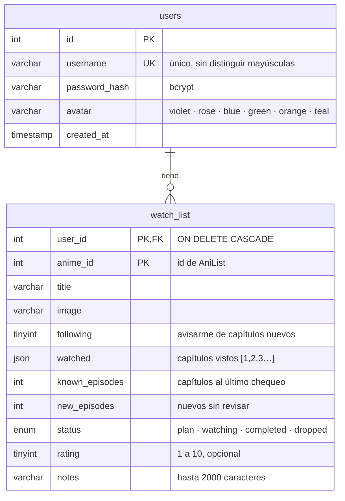

Al eliminar un usuario se borra su lista automáticamente (`ON DELETE CASCADE`).

### Sesión segura

El token **nunca** toca JavaScript: viaja en una cookie `HttpOnly`.

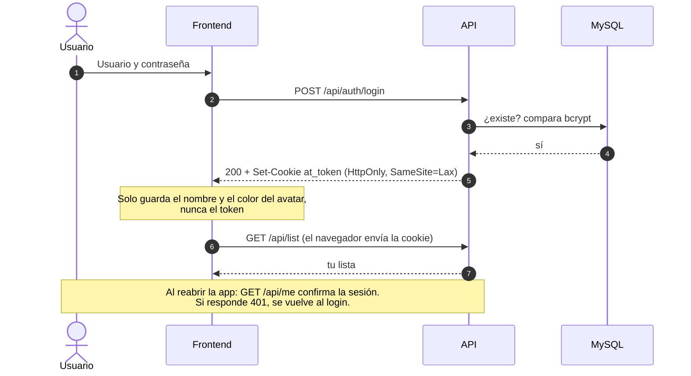

### Cómo se detectan los capítulos nuevos

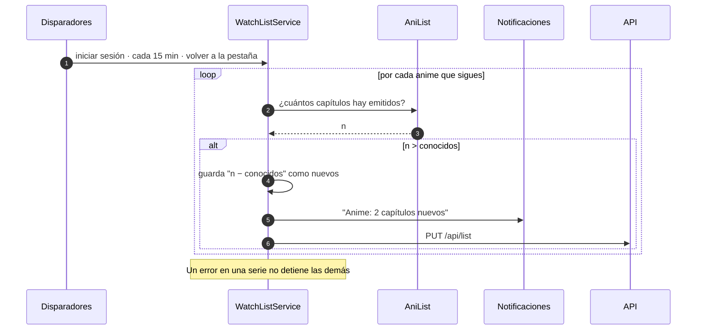

### Estados de un anime

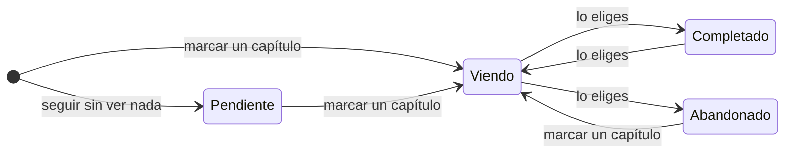

---

## 🔌 Referencia de la API

Base: `http://localhost:3000/api` · Formato JSON · Sesión por cookie `at_token`.

| Método | Ruta | Auth | Descripción |
|---|---|:---:|---|
| `GET` | `/health` | – | Comprobación de vida |
| `POST` | `/auth/register` | – | Crea la cuenta y abre sesión. Contraseña: 8+ caracteres con letras y números |
| `POST` | `/auth/login` | – | Abre sesión |
| `POST` | `/auth/logout` | – | Cierra sesión (borra la cookie) |
| `GET` | `/me` | ✅ | Perfil: `{ username, avatar }` |
| `PATCH` | `/me` | ✅ | Cambia `username` y/o `avatar` (`409` si el nombre está ocupado) |
| `PUT` | `/me/password` | ✅ | Cambia la contraseña: `{ currentPassword, newPassword }` |
| `DELETE` | `/me` | ✅ | Elimina la cuenta y su lista: `{ password }` |
| `GET` | `/list` | ✅ | Tu lista de seguimiento |
| `PUT` | `/list` | ✅ | Reemplaza tu lista (validada) |

Códigos habituales: `400` datos inválidos · `401` sin sesión · `403` contraseña incorrecta · `409` nombre repetido · `429` demasiados intentos.

---

## ⚙️ Configuración

Variables de `server/.env` (hay un ejemplo en `server/.env.example`):

| Variable | Ejemplo | Descripción |
|---|---|---|
| `DB_HOST` · `DB_PORT` | `localhost` · `3306` | Dónde está MySQL |
| `DB_USER` · `DB_PASSWORD` | `anime_app` · … | Usuario **restringido** (no uses `root`) |
| `DB_NAME` | `anime_tracker` | Base de datos |
| `JWT_SECRET` | 32+ caracteres aleatorios | Firma de las sesiones. **Obligatorio** |
| `PORT` | `3000` | Puerto de la API |
| `CORS_ORIGIN` | `http://localhost:4200` | Origen permitido del frontend |
| `NODE_ENV` | `production` | Con HTTPS: marca la cookie como `Secure` |
| `AUTH_RATE_LIMIT_MAX` | `20` | Intentos de login/registro/contraseña por IP cada 15 min |

La URL de la API que usa el frontend se cambia con el token `API_URL` (`src/app/infrastructure/api-config.ts`).

---

## 🧰 Scripts

| Comando | Qué hace |
|---|---|
| `npm start` | **API + frontend** a la vez (`:3000` y `:4200`) |
| `npm run install:all` | Instala dependencias del frontend y de la API |
| `npm run build` | Compila para producción (con service worker) |
| `npm test` | Pruebas unitarias del frontend |
| `npm run test:api` | Pruebas de la API |
| `npm run test:e2e` | Pruebas de extremo a extremo |
| `npm run test:all` | Frontend + API |
| `npm --prefix server run db:setup` | Crea/actualiza bases, usuario restringido y tablas |
| `node scripts/screenshots.mjs` | Regenera las capturas de este README |

---

## 🧪 Pruebas

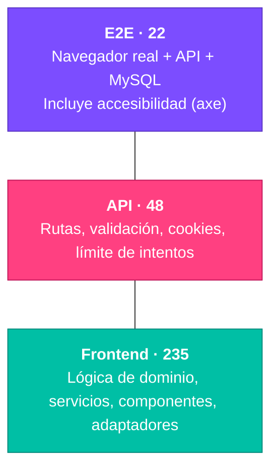

| Nivel | Herramienta | Qué cubre | Necesita |
|---|---|---|---|
| Frontend | Vitest + jsdom | Lógica pura, servicios, componentes y adaptadores HTTP (con `fetch` simulado) | Nada |
| API | Vitest + supertest | Todas las rutas, validación, cookies, CORS y límite de intentos (repositorios en memoria) | Nada |
| E2E | Playwright + axe | Registro, sesión, filtros en la URL, seguimiento, perfil, borrado de cuenta, temas y accesibilidad | MySQL + `db:setup` |

**Sobre las pruebas e2e:**

- Arrancan su **propia API** contra la base `anime_tracker_test` y el servidor de Angular.
- **AniList está simulado**, así que son deterministas y no tocan tus datos reales.
- Usan los puertos `3000` y `4200`: **detén `npm start` antes de ejecutarlas**.
- Por defecto usan **Microsoft Edge** instalado. Para otro navegador: `E2E_CHANNEL=chrome npm run test:e2e`, o `E2E_CHANNEL=` tras `npx playwright install chromium`.
- Al terminar borran los usuarios `e2e*` que crearon.

---

## 🔒 Seguridad

| Medida | Cómo |
|---|---|
| **Contraseñas** | Hash **bcrypt**. Al registrarse: 8+ caracteres con letras y números |
| **Sesión** | JWT en cookie **`HttpOnly`** + `SameSite=Lax` (+ `Secure` en producción). Nada secreto en `localStorage` |
| **Fuerza bruta** | Límite de intentos en login, registro, cambio de contraseña y borrado de cuenta |
| **Base de datos** | Usuario con permisos **solo** `SELECT/INSERT/UPDATE/DELETE`: la app no puede crear ni borrar tablas |
| **Acciones sensibles** | Cambiar la contraseña o borrar la cuenta exige la contraseña actual |
| **Validación** | Todo lo que llega a la API se valida (tipos, longitudes, estados, listas duplicadas) |
| **CORS** | Solo el origen configurado, con credenciales |
| **Cuentas borradas** | Una sesión de una cuenta eliminada se rechaza en todas las rutas |
| **Secretos** | `server/.env` está en `.gitignore`; `JWT_SECRET` obligatorio de 32+ caracteres |

---

## 📦 Docker, CI y PWA

**Docker** — todo con un comando (MySQL + API + web con nginx):

```bash
cp .env.docker.example .env      # completa los secretos
docker compose up --build        # web en http://localhost:8080 · API en :3000
```

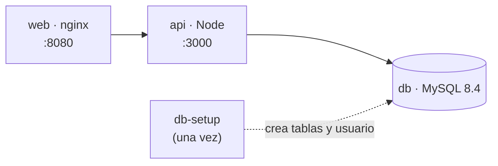

> ⚠️ Los archivos de Docker están escritos pero aún no se han ejecutado en este equipo.

**CI** — `.github/workflows/ci.yml` ejecuta en cada *push* y *pull request*:

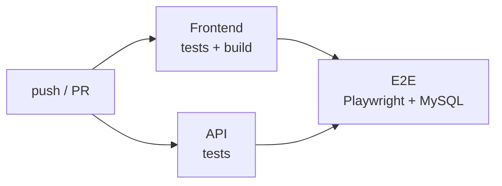

**PWA** — en el build de producción se activa el *service worker*: la app se puede **instalar** (escritorio y móvil), arranca más rápido y cachea las portadas 7 días. Los iconos se generan con `node scripts/make-icons.js`.

**En producción**: sirve todo por **HTTPS**, arranca la API con `NODE_ENV=production` y usa un `JWT_SECRET` largo y aleatorio.

---

## 🩺 Solución de problemas

| Síntoma | Causa probable | Qué hacer |
|---|---|---|
| *"No se pudo conectar con el servidor"* | La API no está en marcha | Ejecuta `npm start` (levanta las dos cosas) |
| La API no arranca: *"Base de datos no lista"* | Falta crear la base o migrar | `npm --prefix server run db:setup` |
| La API no arranca: *"JWT_SECRET debe tener…"* | Falta el secreto en `server/.env` | Genera uno de 32+ caracteres (ver paso 3) |
| *"Access denied for user"* | `DB_USER`/`DB_PASSWORD` no coinciden con el usuario creado | Repite `db:setup` con la misma `APP_PASSWORD` y úsala como `DB_PASSWORD` |
| Te pide iniciar sesión otra vez tras actualizar | La sesión antigua ya no es válida | Inicia sesión de nuevo; tus datos siguen ahí |
| *"Demasiados intentos"* | Límite de intentos por IP | Espera unos minutos |
| El catálogo no carga | AniList no responde o límite de ~30 peticiones/min | Reintenta; la app espacia y reintenta sola |
| `npm run test:e2e` dice que el puerto está en uso | Tienes `npm start` abierto | Deténlo y vuelve a ejecutar |
| Una columna nueva no existe | Falta la migración | `npm --prefix server run db:setup` |

---

## ❓ Preguntas frecuentes

<details>
<summary><b>¿Por qué AniList y no otra API?</b></summary>

Es gratuita, sin clave y entrega el siguiente capítulo programado de cada serie, lo que mejora los avisos. Antes se usó Jikan (MyAnimeList), pero se cambió por disponibilidad; gracias a la arquitectura por puertos solo hizo falta escribir un adaptador.
</details>

<details>
<summary><b>¿Por qué los capítulos no tienen título?</b></summary>

AniList no publica el listado de capítulos con sus títulos. La app numera los capítulos ya emitidos ("Capítulo 1", "Capítulo 2"…).
</details>

<details>
<summary><b>¿Cómo cambio de usuario de MySQL o de base?</b></summary>

Ejecuta `npm --prefix server run db:setup` con las variables `APP_USER`, `APP_PASSWORD` y `DB_NAMES` que quieras, y actualiza `server/.env`.
</details>

<details>
<summary><b>¿Puedo ocultar más géneros del filtro?</b></summary>

Sí: añádelos a `HIDDEN_GENRES` en `src/app/infrastructure/anilist-anime-catalog.ts`. Hoy están ocultos *Hentai* y *Ecchi*.
</details>

<details>
<summary><b>¿Se pueden enviar avisos por correo?</b></summary>

No por ahora: las revisiones las hace el navegador mientras la app está abierta. Un aviso por correo requeriría una tarea programada en la API y un servidor de correo.
</details>

---

## 🙏 Créditos

- Datos del catálogo: **[AniList](https://anilist.co)** (API GraphQL pública). AnimeTracker no está afiliado a AniList.
- Interfaz: **[Angular](https://angular.dev)** y **[Angular Material](https://material.angular.dev)**.
- Tipografía: **[Inter](https://rsms.me/inter/)**.
- Las capturas de este documento usan series y carteles **de demostración**, generados para el proyecto.
